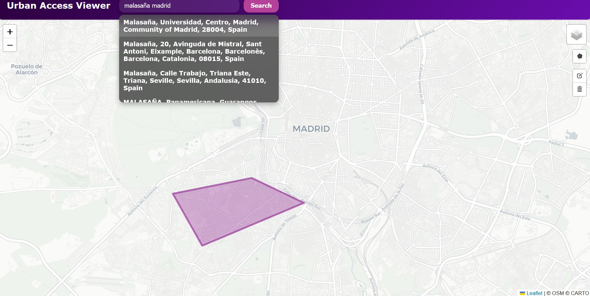

## Minimal React Map for Urban Access Viewer

A modern React application for searching addresses, displaying markers, and drawing polygons on a map. Built with **React**, **Leaflet**, **React-Leaflet**, and **React-Leaflet-Draw**.

This is part of an ongoing research program in collaboration with MIT Media Lab and UPM researchers. Frontend only.



## Features

- **Address search** with autocomplete using [Nominatim API](https://nominatim.org/).  
- **Multiple base map layers**: Gray (default), Dark, OpenStreetMap.  
- **Draw polygons** directly on the map with shading and editable/deletable layers.  
- **Glassmorphism UI** for input and buttons, plus autocomplete suggestions.  
- Responsive layout and smooth interactions.

## Available Scripts

In the project directory, you can run:

```bash
npm install
npm start
```

Runs the app in the development mode.\
Open [http://localhost:3000](http://localhost:3000) to view it in your browser.


